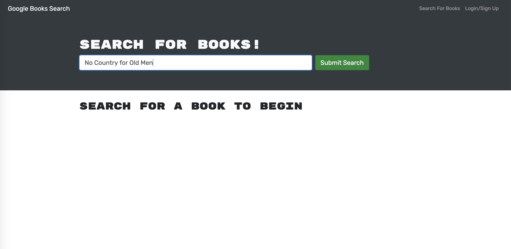
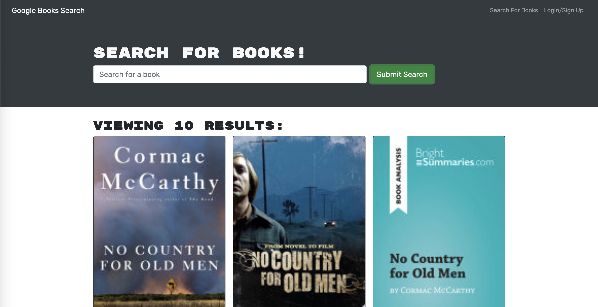
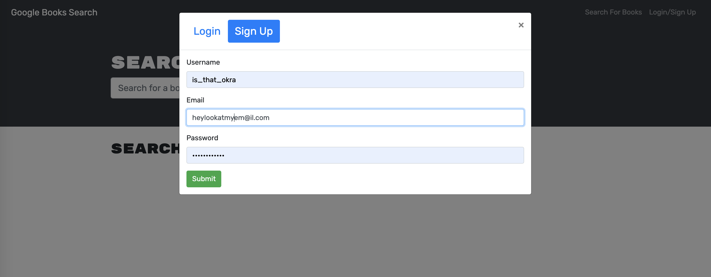
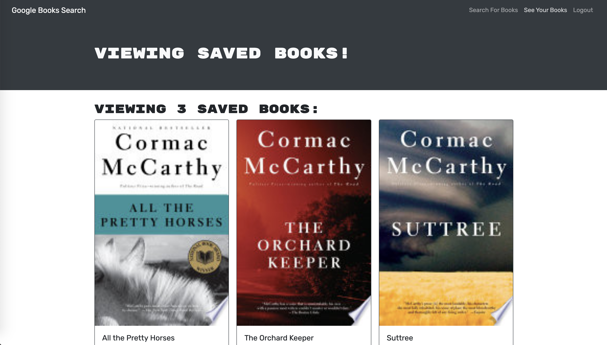

# Google Book Search Engine

  ## Table of Contents
  * [Description](#description)
  * [Usage](#usage)
  * [License](#license)
  * [Contribution Guidelines](#contribution-guidelines)
  * [Tests](#tests)
  * [Questions](#questions)
  

  ## Description  
  Tap into Google's boundless selection of books using a sleek and user friendly search feature. Log in to save your favorites to your own personal library.  
    
  [Link to live page.](https://shielded-atoll-58901.herokuapp.com/)

  ## Usage
  ### Search for books...
  
  

  ### Sign up...  

    
  
    
  ### Save your favorites...    
  

  ## License
  This project is covered under MIT.

  ## Contribution Guidelines
  It's chaos; be kind. 

  ## Tests  
  n/a

  ## Questions
  Please direct all inquiries to [jessicajernigan](https://github.com/jessicajernigan) via email at: [jernigan.jessica.leigh@gmail.com](mailto:jernigan.jessica.leigh@gmail.com?subject=Question%20About%20Google%20Book%20Search%20+%20Library)

